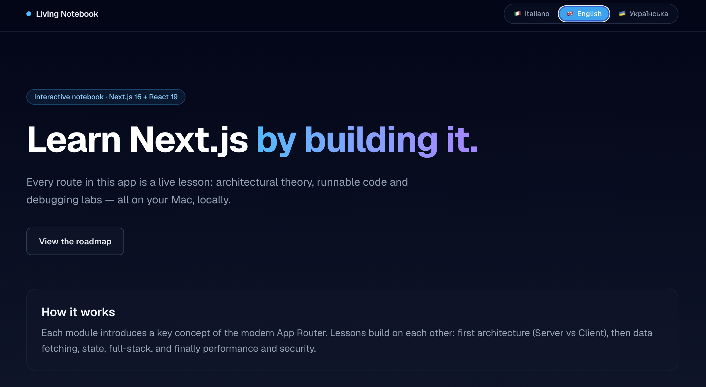
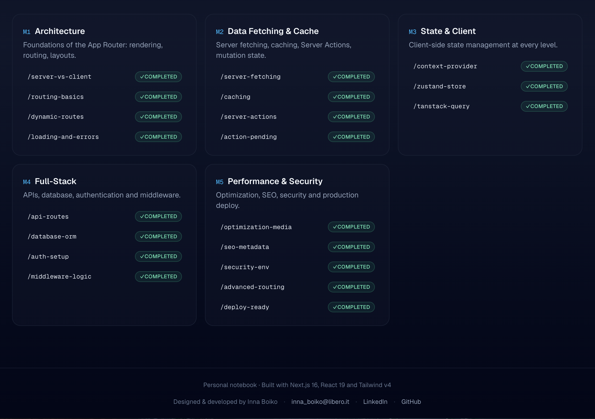
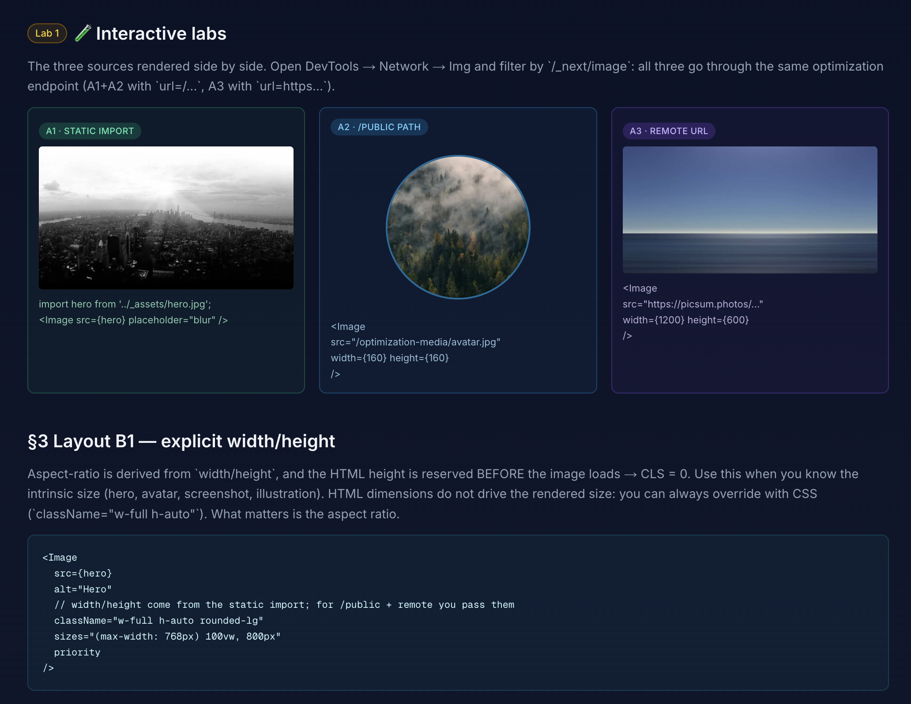
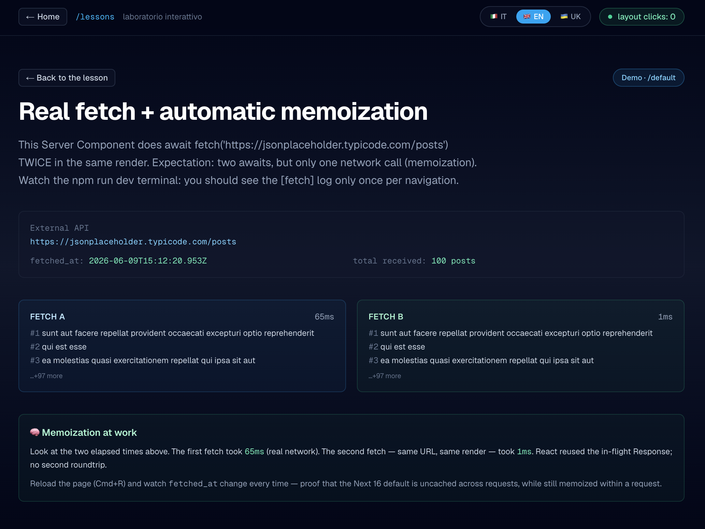

# Living Notebook — Next.js 16 / React 19

> An interactive learning notebook where every route is a hands-on lesson on the
> modern App Router. Architecture theory, runnable code, and debugging labs —
> all in one app.

[](https://github.com/InnaIvBoiko/next-js-notebook/actions/workflows/ci.yml)
[](https://nextjs.org/)
[](https://react.dev/)
[](https://www.typescriptlang.org/)
[](https://tailwindcss.com/)
[](https://next-js-notebook.vercel.app/)

**🌐 Live:** [next-js-notebook.vercel.app](https://next-js-notebook.vercel.app/)
**📘 Translations:** [Italiano](./README-it.md) · [Українська](./README-ukr.md)

---

## Table of Contents

- [What is this](#what-is-this)
- [Screenshots](#screenshots)
- [Quick start](#quick-start)
- [The 5 modules · 20 lessons](#the-5-modules--20-lessons)
- [Tech stack](#tech-stack)
- [Project structure](#project-structure)
- [Environment variables](#environment-variables)
- [Architecture highlights](#architecture-highlights)
- [Deploy](#deploy)
- [Scripts](#scripts)
- [Testing](#testing)
- [Browser support](#browser-support)
- [Contributing](#contributing)
- [Credits](#credits)

---

## What is this

A **real Next.js 16 application** where every route under `/lessons/*` is a
self-contained lesson. Each lesson combines:

1. **Architectural theory** — what the API does, why it exists, and the
   trade-offs against alternatives.
2. **Working code** — the lesson IS the demo; no separate snippets to
   copy-paste.
3. **Debugging lab** — step-by-step instructions to observe the mechanism in
   action (terminal logs, DevTools Network tab, React DevTools, etc.).

The notebook is **trilingual** (Italian · English · Ukrainian) with a
cookie-driven language switcher that survives navigation and SSR. The base
language is Italian.

It is **not** a tutorial site, a static blog, or a slide deck. It is an app you
run locally with `npm run dev`, navigate with your browser, and break with your
debugger.

---

## Screenshots

| Home — hero & language switcher                 | Home — the 5-module roadmap                 |
| ----------------------------------------------- | ------------------------------------------- |
|  |  |

| Lesson 16 — `next/image` interactive lab                                  | Lesson 5 — fetch memoization debugging lab                              |
| ------------------------------------------------------------------------- | ----------------------------------------------------------------------- |
|  |  |

> **▶️ Live demo:**
> [next-js-notebook.vercel.app](https://next-js-notebook.vercel.app/)

---

## Quick start

**Requirements**

- Node.js 20+ (uses native `fetch`, `node:test`, modern crypto APIs)
- npm (the project uses `package-lock.json`; pnpm / yarn / bun will work but
  lockfile will diverge)

```bash
# 1. install
git clone https://github.com/InnaIvBoiko/next-js-notebook.git
cd next-js-notebook
npm install

# 2. configure env (see .env.example for what to fill in)
cp .env.example .env.local
# generate a 32-byte secret for AUTH_SECRET / WEBHOOK_SECRET:
#   openssl rand -base64 32

# 3. run
npm run dev
# open http://localhost:3000
```

The dev server uses Turbopack. The first request to a lesson compiles its module
graph on demand (~200ms warm, ~2s cold) and is then cached.

---

## The 5 modules · 20 lessons

Every lesson is a route. Click to open in the live deploy.

### Module 1 · Architecture · the App Router foundations

| #   | Route                                                                                   | What you learn                                                                                   |
| --- | --------------------------------------------------------------------------------------- | ------------------------------------------------------------------------------------------------ |
| 1   | [`/server-vs-client`](https://next-js-notebook.vercel.app/lessons/server-vs-client)     | Server vs Client Components: which APIs work where, hydration boundary, `'use client'` semantics |
| 2   | [`/routing-basics`](https://next-js-notebook.vercel.app/lessons/routing-basics)         | File-system routing, nested layouts, layout state persistence across navigations                 |
| 3   | [`/dynamic-routes`](https://next-js-notebook.vercel.app/lessons/dynamic-routes)         | `[id]` segments, `generateStaticParams`, typed params with `PageProps<>`                         |
| 4   | [`/loading-and-errors`](https://next-js-notebook.vercel.app/lessons/loading-and-errors) | `loading.tsx` Suspense boundaries, `error.tsx` Error Boundaries, streaming                       |

### Module 2 · Data fetching & cache

| #   | Route                                                                             | What you learn                                                                                              |
| --- | --------------------------------------------------------------------------------- | ----------------------------------------------------------------------------------------------------------- |
| 5   | [`/server-fetching`](https://next-js-notebook.vercel.app/lessons/server-fetching) | `async` Server Components, `Promise.all` for parallel fetches, `cookies()`/`headers()` as request-time data |
| 6   | [`/caching`](https://next-js-notebook.vercel.app/lessons/caching)                 | Cache Components (`'use cache'`), `cacheLife`/`cacheTag`, React `cache()` for per-request memoization       |
| 7   | [`/server-actions`](https://next-js-notebook.vercel.app/lessons/server-actions)   | `'use server'` functions, form actions, `revalidatePath` / `revalidateTag`                                  |
| 8   | [`/action-pending`](https://next-js-notebook.vercel.app/lessons/action-pending)   | `useFormStatus`, `useActionState`, `useOptimistic`                                                          |

### Module 3 · State & client patterns

| #   | Route                                                                               | What you learn                                                                                         |
| --- | ----------------------------------------------------------------------------------- | ------------------------------------------------------------------------------------------------------ |
| 9   | [`/context-provider`](https://next-js-notebook.vercel.app/lessons/context-provider) | Server-into-Client pattern, splitting Context into Read + Write providers to avoid spurious re-renders |
| 10  | [`/zustand-store`](https://next-js-notebook.vercel.app/lessons/zustand-store)       | Zustand with `persist` middleware, selectors, SSR hydration                                            |
| 11  | [`/tanstack-query`](https://next-js-notebook.vercel.app/lessons/tanstack-query)     | `useQuery`/`useMutation`, polling with `refetchInterval`, Devtools                                     |

### Module 4 · Full-stack

| #   | Route                                                                               | What you learn                                                                                 |
| --- | ----------------------------------------------------------------------------------- | ---------------------------------------------------------------------------------------------- |
| 12  | [`/api-routes`](https://next-js-notebook.vercel.app/lessons/api-routes)             | Route Handlers (`route.ts`), dynamic segments, JSON / Streaming responses                      |
| 13  | [`/database-orm`](https://next-js-notebook.vercel.app/lessons/database-orm)         | Drizzle ORM + PGlite (WASM Postgres in-process), typed schema, migrations                      |
| 14  | [`/auth-setup`](https://next-js-notebook.vercel.app/lessons/auth-setup)             | Auth.js v5: edge-safe config split, Credentials provider with bcrypt, DrizzleAdapter           |
| 15  | [`/middleware-logic`](https://next-js-notebook.vercel.app/lessons/middleware-logic) | `proxy.ts` (renamed from `middleware.ts` in Next 16): auth gating, header injection, redirects |

### Module 5 · Performance & security

| #   | Route                                                                                   | What you learn                                                                                                     |
| --- | --------------------------------------------------------------------------------------- | ------------------------------------------------------------------------------------------------------------------ |
| 16  | [`/optimization-media`](https://next-js-notebook.vercel.app/lessons/optimization-media) | `next/image` (3 source kinds × 2 layouts), `next/font/google` self-hosted (Inter + JetBrains Mono)                 |
| 17  | [`/seo-metadata`](https://next-js-notebook.vercel.app/lessons/seo-metadata)             | Static + dynamic `metadata`, `generateMetadata`, `ImageResponse` for OG, typed `sitemap.ts` / `robots.ts`, JSON-LD |
| 18  | [`/security-env`](https://next-js-notebook.vercel.app/lessons/security-env)             | zod-typed env at boot, `server-only` tripwire, static security headers, CSP nonce in proxy, HMAC webhook           |
| 19  | [`/advanced-routing`](https://next-js-notebook.vercel.app/lessons/advanced-routing)     | Route groups `(group)`, parallel routes `@slot`, intercepting routes `(..)folder`, catch-all `[...path]`           |
| 20  | [`/deploy-ready`](https://next-js-notebook.vercel.app/lessons/deploy-ready)             | `next build` anatomy, Node vs Edge runtime, output modes, CI/CD pipeline, pre-flight checklist                     |

---

## Tech stack

| Layer          | Choice                          | Why                                             |
| -------------- | ------------------------------- | ----------------------------------------------- |
| Framework      | **Next.js 16.2** (App Router)   | The whole point of the notebook                 |
| UI             | **React 19.2**                  | Server Components, `use()`, `useOptimistic`     |
| Language       | **TypeScript 5**                | All lessons fully typed, no `any`               |
| Styling        | **Tailwind CSS v4**             | Zero-config, CSS-first, faster than v3          |
| State (client) | **Zustand 5**                   | Tiny, no boilerplate; Lesson 10                 |
| Server cache   | **TanStack Query 5**            | Used in Lesson 11 (client cache)                |
| ORM            | **Drizzle ORM 0.45**            | Type-safe SQL, no abstraction tax               |
| Database       | **@electric-sql/pglite**        | WASM Postgres in-process — zero-install demo DB |
| Auth           | **Auth.js v5** (next-auth beta) | Edge-compatible session, OAuth + Credentials    |
| Validation     | **zod 4**                       | Env schema (Lesson 18), webhook payloads        |
| Hashing        | **bcryptjs**                    | Credentials provider (Lesson 14)                |
| Boundary guard | **server-only**                 | Tripwire for accidental client imports          |

---

## Project structure

```
.
├── app/                              # App Router root
│   ├── _components/                  # Home page components
│   │   └── notebook-shell.tsx        # Hero + roadmap + footer
│   ├── _lib/                         # Shared (gitignored prefix)
│   │   └── dictionaries.ts           # IT/EN/UK home dictionary
│   ├── api/                          # Route Handlers
│   │   ├── auth/[...nextauth]/       # Auth.js
│   │   ├── echo/[...path]/           # catch-all demo (Lesson 12)
│   │   ├── items/                    # mock REST (Lesson 12)
│   │   ├── me/notes/                 # protected (Lesson 14)
│   │   ├── notes/                    # CRUD (Lesson 13)
│   │   ├── now-static/               # cached route (Lesson 6)
│   │   ├── now-dynamic/              # uncached route (Lesson 6)
│   │   ├── runtime-probe/            # Lesson 20
│   │   ├── server-time/              # polling source (Lesson 11)
│   │   └── webhook/                  # HMAC-signed POST (Lesson 18)
│   ├── lessons/                      # Every lesson is a route
│   │   ├── _components/              # Shared header components
│   │   │   ├── lang-bar.tsx          # IT/EN/UK switcher
│   │   │   ├── lang-provider.tsx     # Cookie-backed Context
│   │   │   ├── persistence-probe.tsx # "layout clicks: N" demo
│   │   │   └── render-counter.tsx
│   │   ├── layout.tsx                # /lessons/* shell
│   │   ├── [lesson]/                 # One folder per lesson
│   │   │   ├── page.tsx              # Server entry
│   │   │   ├── _components/          # Lesson-local UI
│   │   │   └── _lib/                 # Lesson-local i18n + helpers
│   │   └── …
│   ├── opengraph-image.tsx           # Default OG image (Lesson 17)
│   ├── robots.ts                     # Typed robots.txt (Lesson 17)
│   ├── sitemap.ts                    # Typed sitemap (Lesson 17)
│   └── page.tsx                      # Home (notebook landing)
├── public/                           # Static assets (favicons, images)
├── auth.ts                           # Auth.js full config (Node-only)
├── auth.config.ts                    # Auth.js edge-safe config
├── proxy.ts                          # Edge proxy (renamed middleware.ts)
├── next.config.ts                    # Cache Components + headers + images
├── eslint.config.mjs                 # Flat config
├── package.json
├── tsconfig.json
├── .env.example                      # Env template (commit this)
├── .env.local                        # Real secrets (NEVER commit)
├── README.md                         # This file
├── README-it.md                      # Italian translation
├── README-ukr.md                     # Ukrainian translation
├── ARCHITECTURE.md                   # Deep technical notes
└── CONTRIBUTING.md                   # How to extend the notebook
```

The leading underscore on `_components/` / `_lib/` marks them as **private
folders** — Next.js ignores them for routing (so they don't become URLs).

---

## Environment variables

Copy `.env.example` to `.env.local` and fill in the values. **`.env.local` is
gitignored.**

| Variable                   | Required | Purpose                                                    |
| -------------------------- | -------- | ---------------------------------------------------------- |
| `WEBHOOK_SECRET`           | ✅       | HMAC signing for `/api/webhook` (Lesson 18). Min 16 chars. |
| `AUTH_SECRET`              | ✅       | Session encryption for Auth.js. Min 32 chars.              |
| `AUTH_GITHUB_ID`           | optional | GitHub OAuth client id (Lesson 14)                         |
| `AUTH_GITHUB_SECRET`       | optional | GitHub OAuth client secret                                 |
| `NEXT_PUBLIC_SITE_NAME`    | optional | Defaults to `"Living Notebook"`                            |
| `NEXT_PUBLIC_FEATURE_BETA` | optional | `"true"` to enable beta features; defaults `false`         |

Anything prefixed with `NEXT_PUBLIC_` ships to the browser bundle. **Never put a
secret there.**

Validation happens at module load: if any required var is missing or malformed,
the dev server and `npm run build` crash with the exact field name. See
[`app/lessons/security-env/_lib/env.ts`](app/lessons/security-env/_lib/env.ts).

Generate secrets:

```bash
openssl rand -base64 32   # AUTH_SECRET
openssl rand -hex 32      # WEBHOOK_SECRET
```

---

## Architecture highlights

A summary of the design choices that make this app what it is. The full
deep-dive is in [ARCHITECTURE.md](./ARCHITECTURE.md).

### Cache Components

`next.config.ts` enables `cacheComponents: true`. Pages are partially
prerendered: a static shell ships from the CDN immediately, dynamic parts stream
in behind `<Suspense>` boundaries. Build output shows `◐` (partial) instead of
`○` (static) or `λ` (dynamic).

Consequence: **layouts cannot read uncached request data** unless wrapped in
`<Suspense>`. The `/lessons/layout.tsx` wraps the cookie read in a Suspense
boundary for this reason.

### Edge proxy

`proxy.ts` (renamed from `middleware.ts` in Next 16) runs on the Edge runtime
for every matched request. Three concerns layered:

1. **Auth** — `auth()` from Auth.js refreshes session cookies and injects
   `req.auth`.
2. **Locale** — reads `nb-lang` cookie; if missing, sniffs `Accept-Language` for
   `it`/`en`/`uk`, writes the cookie back. This is what lets `<LangProvider>`
   render the correct language **server-side** without SSR/CSR mismatch.
3. **Gating** — `/lessons/middleware-logic/protected*` requires a `nb-demo-pass`
   cookie or redirects (307).
4. **Headers** — injects `x-pathname` and `x-geo-country` for downstream RSCs.

### Cookie-driven i18n

The notebook ships its own i18n implementation (no `next-intl` /
`next-i18next`):

- Dictionary files are TypeScript objects with `it` / `en` / `uk` keys.
- The `<LangProvider>` reads the `nb-lang` cookie via `cookies()` in the layout.
- The `<LangBar>` writes the cookie on user switch + updates Context.
- Server Components in sub-routes read the cookie directly (since they can't use
  `useLang()`).

Trade-off: full type-safety, zero runtime dependencies, but no automated
extraction or pluralization helpers.

### Auth.js v5 split

- `auth.config.ts` — edge-safe (no bcrypt, no DB). Imported by `proxy.ts`.
- `auth.ts` — full config (Credentials + DrizzleAdapter + bcrypt). Imported by
  Server Components.

Without this split the proxy would crash at cold start because bcrypt requires
Node.

### Security layers

- **Env validation** at boot via zod — wrong env → process won't start.
- **`server-only`** tripwire on every module that touches secrets — Turbopack
  throws at build if a Client island accidentally imports them.
- **Static security headers** in `next.config.ts`: HSTS, X-Frame-Options,
  Referrer-Policy, Permissions-Policy.
- **CSP with per-request nonce** generated in `proxy.ts` (`Report-Only` in dev
  so HMR survives, enforced in production).
- **HMAC webhook** with `crypto.timingSafeEqual` to prevent timing attacks.

### Performance

- **`next/image`** with whitelisted remote patterns (`picsum.photos`) → no open
  image proxy.
- **`next/font/google`** self-hosting Inter + JetBrains Mono via CSS variables —
  zero external requests, no FOIT.
- **Static-first**: 15 of 20 lessons prerender; only `/api/*` and auth-gated
  routes are dynamic.

---

## Deploy

### Vercel (zero-config)

```bash
vercel
```

The notebook runs as a single Vercel project. Push to `main` → production
deploy. Push to any branch → preview deploy. The current deploy is at
[next-js-notebook.vercel.app](https://next-js-notebook.vercel.app/).

Set the same env vars from `.env.local` in the Vercel project settings
(Production + Preview scopes).

### Docker (self-host)

Add `output: 'standalone'` to [`next.config.ts`](next.config.ts), then:

```dockerfile
FROM node:20-alpine AS base
WORKDIR /app
COPY package*.json ./
RUN npm ci

FROM base AS build
COPY . .
RUN npm run build

FROM node:20-alpine AS runtime
WORKDIR /app
COPY --from=build /app/.next/standalone ./
COPY --from=build /app/.next/static ./.next/static
COPY --from=build /app/public ./public
ENV NODE_ENV=production
EXPOSE 3000
CMD ["node", "server.js"]
```

Standalone mode produces a tree containing only the dependencies actually used
(~80 MB vs ~800 MB of `node_modules`).

### Static export

Not supported: this app uses API routes, `cookies()`, Server Actions, and
Auth.js — all incompatible with `output: 'export'`. See Lesson 20.

---

## Scripts

| Command                | What it does                                           |
| ---------------------- | ------------------------------------------------------ |
| `npm run dev`          | Turbopack dev server on port 3000                      |
| `npm run build`        | Production build → `.next/`                            |
| `npm start`            | Serve the production build (run `npm run build` first) |
| `npm run lint`         | ESLint flat config                                     |
| `npm run typecheck`    | `tsc --noEmit` — strict type check                     |
| `npm run test`         | Vitest unit suite (single run)                         |
| `npm run test:watch`   | Vitest in watch mode                                   |
| `npm run test:e2e`     | Playwright E2E (auto-boots the server)                 |
| `npm run test:e2e:ui`  | Playwright UI mode (interactive debugging)             |
| `npm run format`       | Prettier write                                         |
| `npm run format:check` | Prettier check (CI)                                    |

A typical pre-commit loop:

```bash
npm run lint && npm run typecheck && npm run test && npm run build
```

---

## Testing

Unit tests run on [Vitest](https://vitest.dev/) (the framework the official
Next.js 16 guide recommends), with `jsdom` for a browser-like environment. The
suite targets the pure `_lib` logic — the part where a regression silently
breaks behaviour:

- **i18n integrity**
  ([`app/_lib/dictionaries.test.ts`](./app/_lib/dictionaries.test.ts)) — asserts
  every language (`it` / `en` / `uk`) shares an identical structural shape, the
  same module ids and lesson slugs, and contains no empty translations. Catches
  translation drift that TypeScript can't see inside dynamic arrays.
- **Dynamic-route data contract**
  ([`items.test.ts`](./app/lessons/dynamic-routes/_lib/items.test.ts)) — locks
  `findItem()` (the function that drives `notFound()`): correct lookup,
  `undefined` for unknown ids, no numeric coercion, unique ids, complete i18n.
- **Server-side language negotiation**
  ([`lang.test.ts`](./app/lessons/advanced-routing/_lib/lang.test.ts)) — mocks
  `next/headers` to verify the `nb-lang` cookie → `Lang` fallback rule
  (`en`/`uk` honoured, anything else → base `it`).

Async Server Components are not yet unit-testable under Vitest (a current React
limitation noted in the Next.js docs), so a small
**[Playwright](https://playwright.dev/) E2E suite**
([`e2e/notebook.spec.ts`](./e2e/notebook.spec.ts)) covers exactly that gap by
driving a real Chromium against the production build:

- the async Server-rendered **home** paints its hero + the M1–M5 roadmap;
- the **cookie-driven language switch** flips the UI and survives a full
  navigation to `/lessons` (the SSR/CSR-agreement feature the app is built
  around);
- an async **lesson route** (`/lessons/server-fetching`) server-renders without
  500-ing.

```bash
npm run test:e2e      # headless, boots the server automatically
npm run test:e2e:ui   # Playwright UI mode for debugging
```

Every push and PR to `main` runs two parallel jobs via
[GitHub Actions](./.github/workflows/ci.yml): the fast gate (**lint → unit test
→ build → typecheck**) and the **Playwright E2E** job.

---

## Browser support

- Chrome / Edge ≥ 110
- Firefox ≥ 110
- Safari ≥ 16

The app uses CSS nesting, `:has()`, container queries, and modern logical
properties. IE / Safari ≤ 15 are not supported.

Tested responsive down to **320 px** width (the narrowest common iPhone SE /
Galaxy Fold-outer viewport).

---

## Contributing

See [CONTRIBUTING.md](./CONTRIBUTING.md). Short version: open an issue first if
you want to add a lesson, follow the existing folder layout (`page.tsx` →
`_components/index-view.tsx` → `_lib/content.ts` for i18n), and run
`npm run lint && npx tsc --noEmit && npm run build` before pushing.

---

## Credits

Designed & developed by **Inna Boiko**.

- 📧 [inna_boiko@libero.it](mailto:inna_boiko@libero.it)
- 💼 [LinkedIn](https://www.linkedin.com/in/inna-boiko/)
- 🐙 [GitHub @InnaIvBoiko](https://github.com/InnaIvBoiko)

Built with the official Next.js, React, and Vercel documentation as the primary
references. The lesson structure draws from Vercel's
[Learn Next.js](https://nextjs.org/learn) course while going significantly
deeper on production patterns (security, observability, edge runtime, deploy).

---

## License

[MIT](./LICENSE) — feel free to fork, adapt, and use as a learning resource.
Attribution appreciated but not required.
